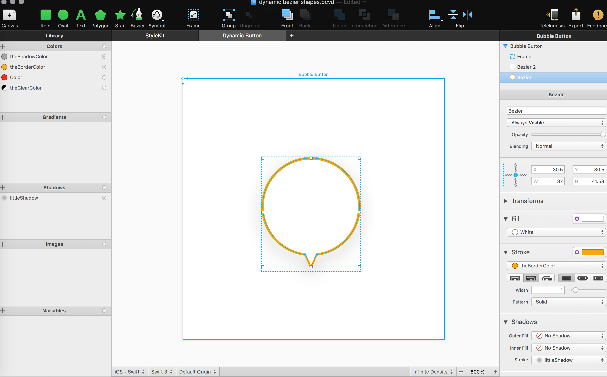
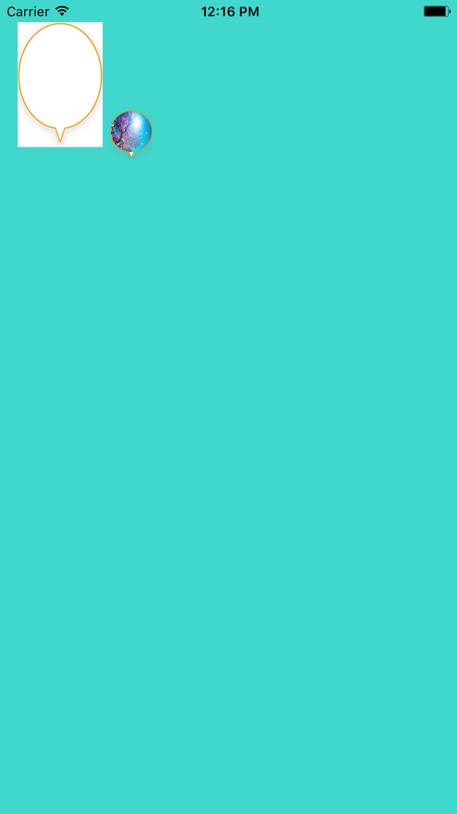

官方教程地址：https://www.paintcodeapp.com/examples

PaintCode能够画出各种自定义的曲线图形（再也不怕设计师的各种曲线和细节实现不了），而且很方便的集成到iOS项目中，支持Swift和Objective-C。尤其是 Dynamic Shapes 支持简单约束，可以保持大小变化时图形规则变化。

## 软件截图：

操作很简单，和Sketch习惯差不多。





## 自定义视图代码：

实现一个带有箭头的圆形边框的图片视图

```swift
import UIKit

class ButtonView: UIView {

    var image: UIImage? {
        didSet {
            if imageView == nil {
                imageView = UIImageView()
                imageView?.backgroundColor = .clear
                imageView?.layer.masksToBounds = true
                self.insertSubview(imageView!, at: 0)
            }
            imageView?.image = image
        }
    }

    private var imageView: UIImageView?

    override func draw(_ rect: CGRect) {
		// 重点代码，一行即可完成
        JLXStyleKit.drawBubbleButton(frame: self.bounds)
    }

    override func layoutSubviews() {
        super.layoutSubviews()

        imageView?.frame = CGRect(x: self.bounds.width * 0.5 / 38.0, y: self.bounds.width * 0.5 / 38.0, width: self.bounds.width * 37 / 38.0, height: self.bounds.width * 37 / 38.0)
        imageView?.layer.cornerRadius = bounds.width / 2.0
    }

}
```


## 运行截图：

